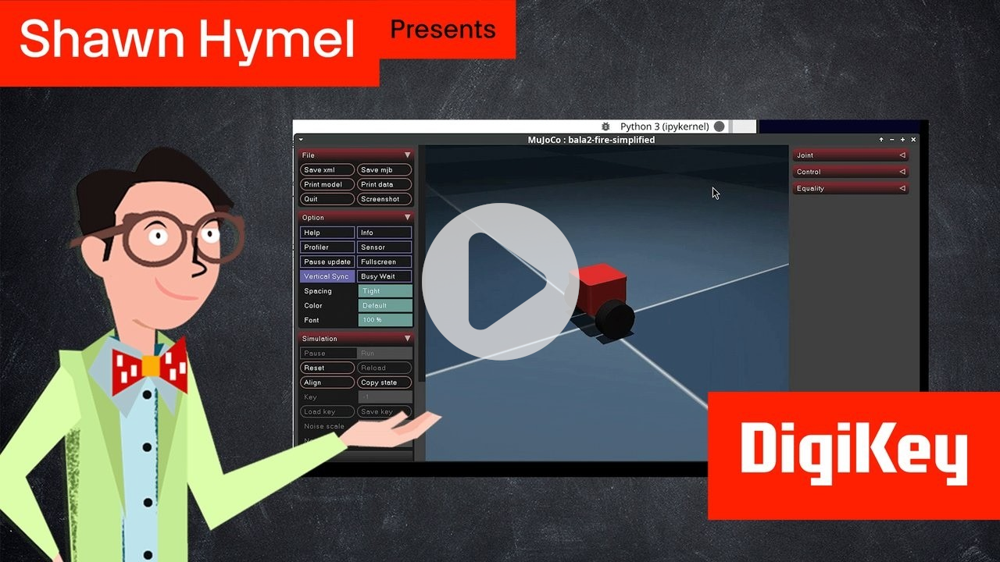
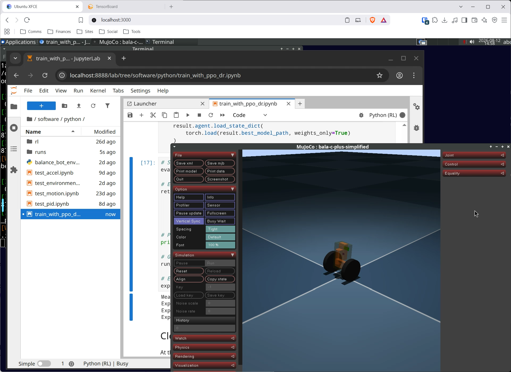
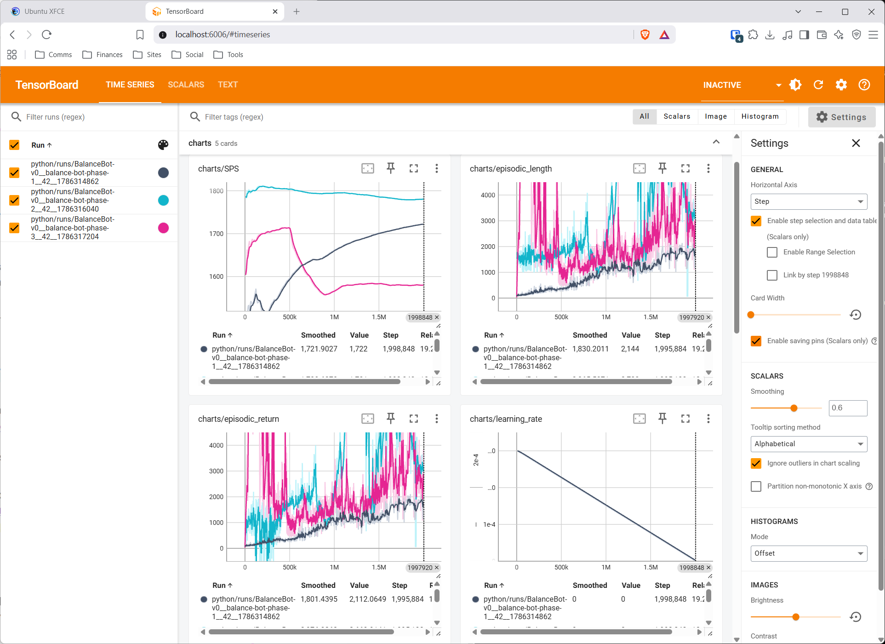
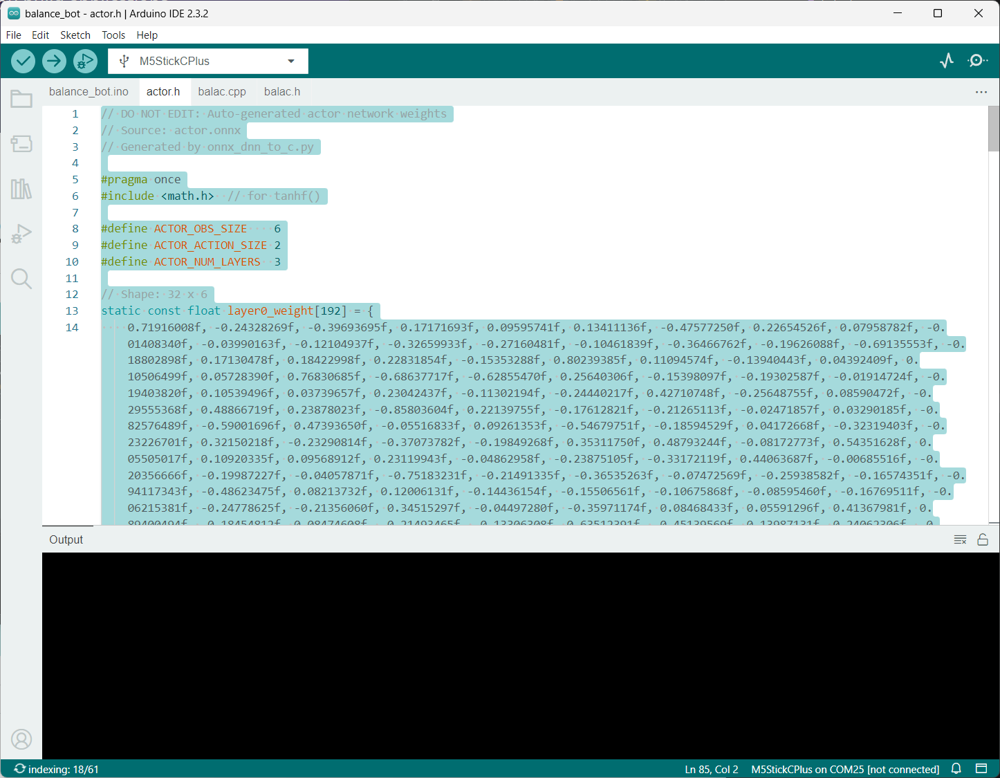

# Workshop: Reinforcement Learning for Robotics

Welcome to the Reinforcement Learning for Robotics workshop! We will work through the basics of converting a 3D CAD model of a robot to simulation, train a reinforcement learning (RL) agent using the PPO algorithm, and then deploy it to a real robot.

To dive deeper, I recommend checking out my full Reinforcement Learning for Robotics video series [here](https://www.youtube.com/watch?v=zsdceSTRBl4&list=PLYExBrZNJeQg&index=1).

<a href="https://www.youtube.com/watch?v=zsdceSTRBl4&list=PLYExBrZNJeQg&index=1">
  
</a>

## Required Hardware

For this workshop, you will need the [M5Stack Bala-C Plus kit](https://www.digikey.com/en/products/detail/m5stack-technology-co-ltd/K038-B/16679760).

Follow the instructions in the kit to build the robot.

## Required Software

You will need to install the following software on your computer:

 * [Docker Desktop](https://www.docker.com/products/docker-desktop/)
 * [Arduino IDE](https://www.arduino.cc/en/software/)

## Installation

Make sure *Docker Desktop* running before continuing to the next step.

Open a terminal and build the Docker image:

```sh
docker build -t rl-robotics -f Dockerfile.cpu .
```

Run the image:

```sh
docker run -it --rm -p 3000:3000 -p 6006:6006 -v "${PWD}/workspace:/workspace" --shm-size=2g rl-robotics
```

Notes:
 * Port 3000 is for the WebTop interface
 * Port 6006 is for TensorBoard
 * VS Code is memory hungry, so we bump the shared memory up to 2 GB

Browse to [http://localhost:3000](http://localhost:3000/) to interact with WebTop.

## Training

On WebTop, open the Jupyter Lab application. Navigate to **workspace/software/python/** and open **train_with_ppo_dr.ipynb**. Click on the first cell and press *shift+enter* to run each cell in sequence. Note that training will take 1-2 hours, depending on your computer's hardware.



On another browser tab (either inside the Docker container or on your host computer), navigate to [http://localhost:6006](http://localhost:6006/). You should see TensorBoard plotting the various charts over the course of the training curriculum.



## Deployment

The last few cells in the training notebook convert the trained AI agent to pure C code (in an *actor.h* file). Find this file on your host computer. It should be in the most recent *workshop/software/python/runs/BalanceBot-v0_balance-bot-phase-3_.../* folder. Open the file and copy the contents.

Open *workspace/software/arduino/balance_bot/balance_bot.ino* in the Arduino IDE. Navigate to the *actor.h* tab. Highlight the existing code (previously trained actor neural network), delete it, and paste in your newly generated *actor.h* code.



Go to **File > Preferences**. Add the following URL to the *Additional boardss manager URLs* list:

```
https://static-cdn.m5stack.com/resource/arduino/package_m5stack_index.json
```

Click **OK** and let the new board definition install.

In the *Library Manager*, search for and install the following libraries:

 * **M5GFX**
 * **M5Unified**

Connect the balance bot to your computer using a USB cable. Upload the *balance_bot.ino* sketch to the robot. Once complete, unplug the USB cable from the robot, carefully set the robot upright on a smooth, level surface, and let it go.

> The M5Stack Bala-C does not include encoders on the motors or wheels. As a result, it will struggle to stay upright in one place. The 3-phase training cycle does a decent job at including estimated position and heading information, but it's far form perfect. The more expensive [Bala2 Fire](https://www.digikey.com/en/products/detail/m5stack-technology-co-ltd/K014-E/16679752) includes encoders and does a much better job at balancing. I use the Bala2 Fire in the video series for this reason.

## License

All software in this repository, unless otherwise noted, is licensed under the [Apache-2.0](https://www.apache.org/licenses/LICENSE-2.0) license.

This README document, all included images, and the slides are licensed under [Creative Commons Attribution 4.0 International (CC BY 4.0)](https://creativecommons.org/licenses/by/4.0/deed.en).